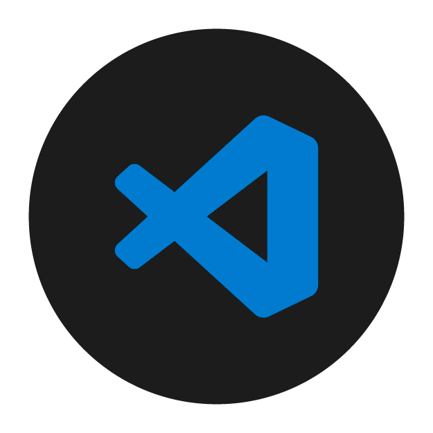
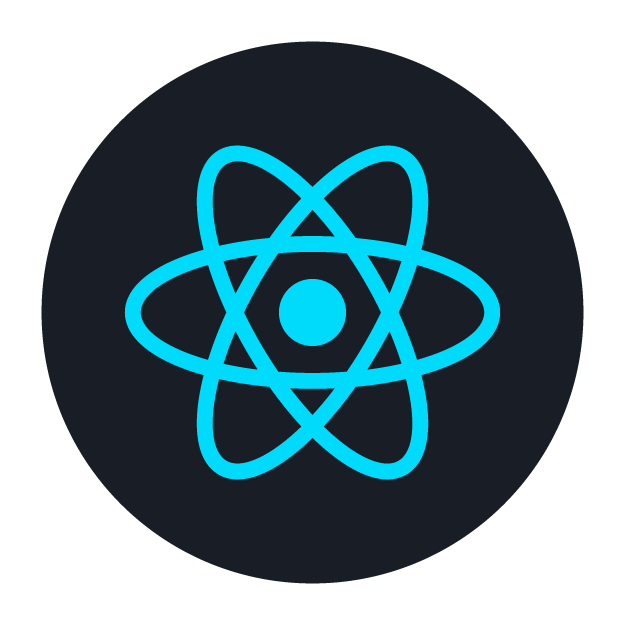
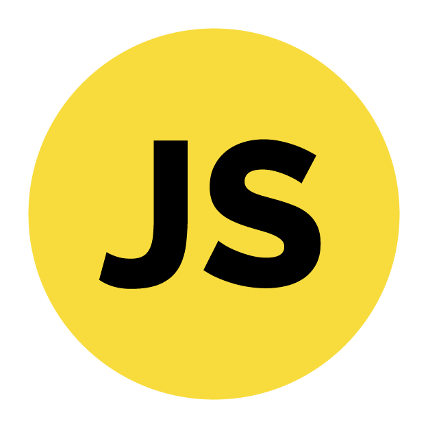

<!-- - 🔭 I’m currently working on ...
- 🌱 I’m currently learning ...
- 🤔 I’m looking for help with ...
- 💬 Ask me about ...
- 📫 How to reach me: ...
- 😄 Pronouns: ...
- ⚡ Fun fact: ... -->
 # Hola Compañeros Desarrolladores 👋

## Henry Moreno
----
----

   
Hola! Soy un desarrollador full-stack 
que busca hacer sus primeros pasos en el munndo It,
También colaboro en proyectos como Freelance FullStack.
Estoy más orientado al Frontend, pero también hago Backend.
gracias por tomarte el tiempo de ver 
mi perfil de Github 😄 

- 🔭 Actualmente me encuentro conociendo nuevas tecnologias.

- 🌱 Me encuentro en busqueda laboral activa.

- 👯 Busco colaborar en Proyectos, Trabajos en la industria IT, Satrtups.

- 💬 Me gusta la programacion, y la ingenieria de sistemas.

<!-- link de programacion -->

## Habilidades
****
### bootstrap

 
 
 
 
 
 
  
   
   

<!--  -->

****

<!-- link de redesde sociales -->

<!-- link de  -->
